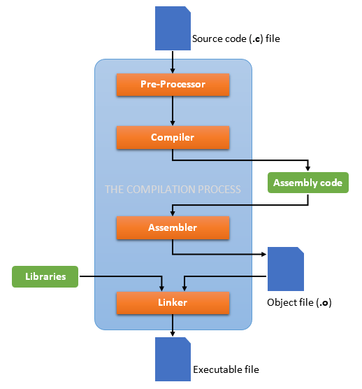

# Compiling, Assembling & Linking
The code (starting with a C program) is compiled, assembled, and linked using `gdb` (GNU Debugger).  
`gdb` is a wrapper function, that's why it is able to do all 3 steps when it is called.  

 - The steps are as shown below:  

     

 - The flow is ` <program.c> -> <program.s> -> <program.o> -> <program> (executable file) `
 - The `<program.o>` (object) file has bits that will go into memory, but it addresses aren't assigned.
 - The `<program>` (executable) file has bits that will go into memory, and it also assigns addresses to them. This is the job of the linker.

- If compile-assemble-link steps are broken down:
   - `gcc program.c -S -o program.s` performs compilation only
   - `as program.s -o program.o` only assembles it
   - `ld program.o -o program` performs linking; final executable is generated

 - Here the flow of this specific program is shown:
   - `main.c -> main.s -> main.o -> program`
   - `fib.s -> fib.o -> program`

