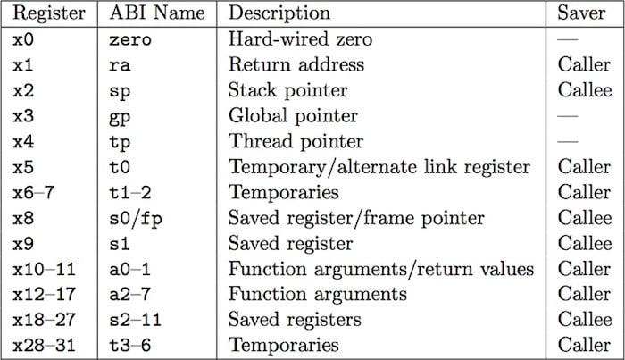

# Registers in RISC-V
 - There are 32 general-purpose registers. Their size depends on the Instruction Set Architecture (ISA): 
        RV32 -> 32-bit (4-byte) registers 
        RV64 -> 64-bit (8-byte) registers  

 - The **32 general-purpose registers** available in RISC-V are as follows, along with their alternate names (which are preferred to be used), and their explanation:  
         

## Dedicated Registers

- **x0 (zero):** 
  - This register is hardwired to 0, which doesn't make it a general-purpose register because nothing can be stored inside of it. 
  - It is like `/dev/null` of Linux (when writing anything to it). If it is written to, then whatever is written gets lost but the register holds 0. 
  - It is convenient to use when making register contents 0.  

- **x1 (ra):** 
  - CALL instruction stores/saves to `x1` register. 
  - RET instruction makes Program Counter jump to address stored in `x1`. 
  - Advantage: CALL and RET instructions don't happen to touch the memory. 
  - Disadvantage: Nested calls (but 'leaf' functions are still fast).  

- **x2 (sp):** 
  - No special 'stack pointer register'. 
  - Programming convention only. 
  - Can be used as a stack pointer or a general-purpose register. 
  - _Note: Some compressed instructions assume x2 as the `stack pointer`, like the command `c.lwsp rd, offset(sp)`_  

- **x3 (gp):** 
  - This points to an area where global (static) variables are kept. This makes addressing easier. 
  - An example instruction: `lw t0, 32(gp)`

- **x4 (tp):** 
  - This points to an area where variables are kept, but it can also point to thread-specific variables such as: 
    - Thread ID 
    - Parameters to thread 
    - Global (static) variables local to the thread  

## CALLer-Saved Registers

- **x10 to x17 (a0 to a7):** 
  - Used for passing arguments, but at most 8 arguments can be passed on these. 
  - If more than 8 arguments are to be passed, or arguments of size greater than the register size are to be passed, then the arguments should be passed to the stack. 
  - If any results are obtained (such as from a function which was called), then that result is stored in `a0`.  

- **x5, x6, x7, x28 to x31 (t0 to t6):** 
  - These can be used when performing operations. Also called as "work" registers. 
  - Any function can modify them (by convention). Hence it is the responsibility of the CALLer function to save the data from these registers (could be to stack) before proceeding. 
  - _Note: Similar to these, Argument Registers `a0, ... , a7` are also CALLer saved._  

## CALLee-Saved Registers

- **x8, x9, x18 to x27 (s0 to s11):** 
  - These can also be used as work registers, but these have to be saved and then restored by the "called" function because these are CALLee saved. 
  - These can be used if something is to be preserved across a function call.  

